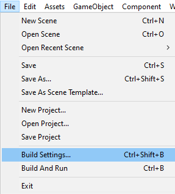
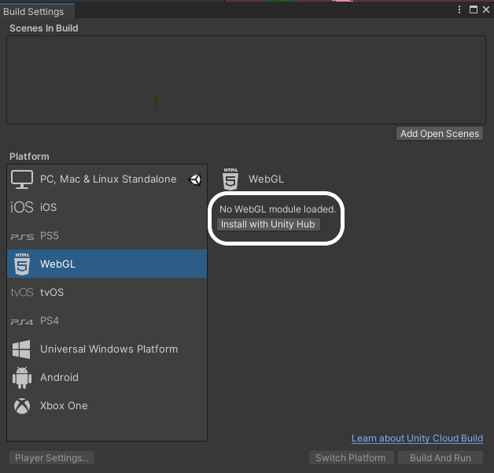
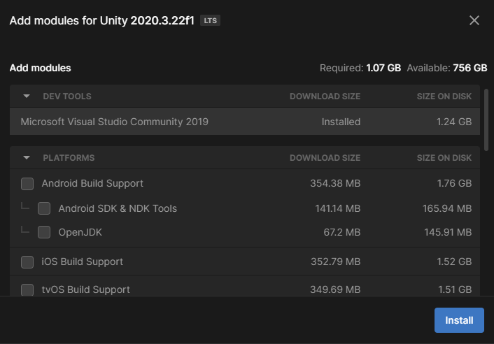
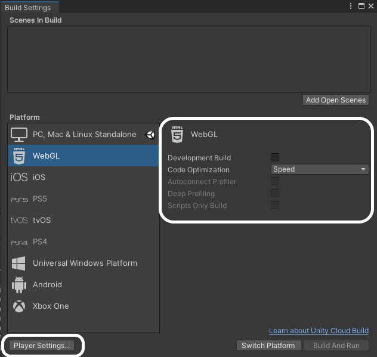
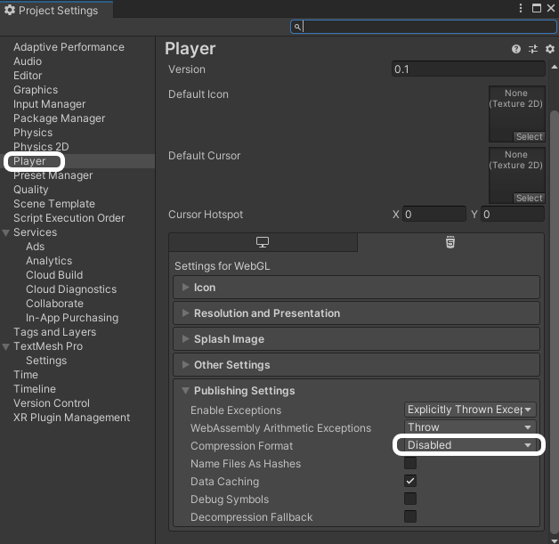

Si es la primera vez que exportas un proyecto a WebGL, debes cambiar la configuración de compilación.

Haz clic en el menú **File** y selecciona **Build Settings...**.

En la siguiente pantalla, selecciona **WebGL** y haz clic en la opción **Install wiht Unity Hub**.

En la siguiente pantalla, haz clic en el botón **Install** y luego espera a que se instale el módulo WebGL.

Una vez que el módulo se haya instalado, puedes cerrar Unity Hub, y luego cerrar Unity y reiniciarlo.

Una vez que Unity se haya vuelto a abrir, verifica que **Build Settings...** del menú **File** se haya actualizado y muestre que WebGL está instalado. Luego haz clic en el botón **Player Settings**

En el menú de **Player** de la izquierda, en el menú plegable de **Publishing Settings**, selecciona **Disabled** de las opciones de **Compression Format**.

Ahora puedes cerrar la ventana de configuración y continuar con la complilación del proyecto.
