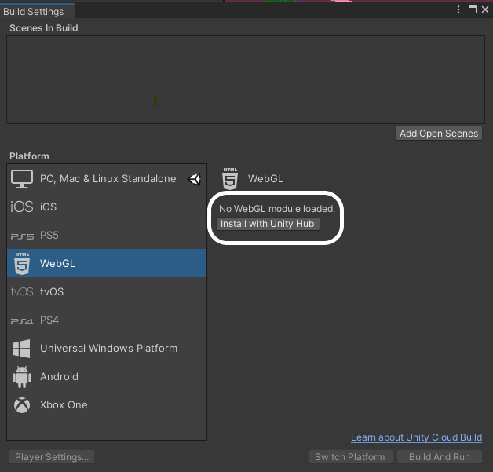
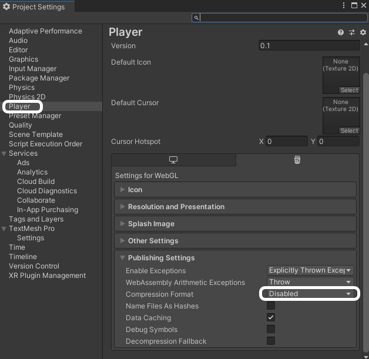

Si c'est la première fois que tu exportes un projet en WebGL, tu dois modifier tes build settings.

Clique sur le menu **File** et sélectionne **Build Settings...**.

Sur l'écran suivant, sélectionne **WebGL** et clique sur le bouton **Install with Unity Hub**.

Sur l'écran suivant, clique sur le bouton **Install**, puis attends que le module WebGL soit installé.

Une fois le module installé, tu peux fermer Unity Hub, puis fermer Unity et le redémarrer.

Une fois Unity ouvert, vérifie que les **Build Settings** du menu **File** ont été mis à jour, et montre que WebGL a été installé. Clique ensuite sur le bouton **Player Settings**

Dans le menu **Player** de gauche, dans le menu déroulant **Publishing Settings**, sélectionne **Disabled** parmi les options **Compression Format**.

Tu peux fermer la fenêtre des paramètres et passer maintenant à la création du projet.
