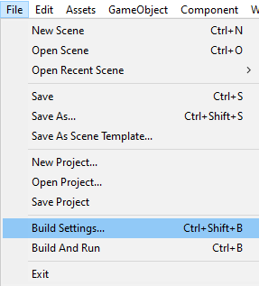
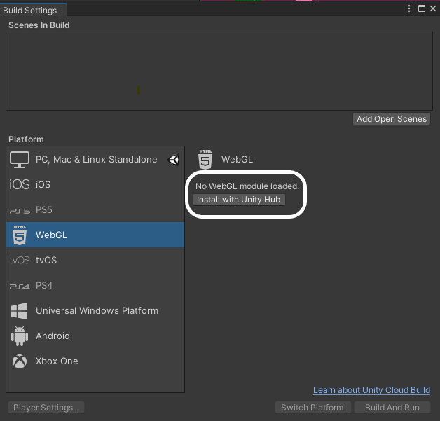

If this is your first time exporting a project to WebGL, you need to change your build settings.

Klik op het **File** menu en selecteer **Build Settings...**.

Selecteer in het volgende scherm **WebGL** en klik op de **Install with Unity Hub** knop.

Klik in het volgende scherm op de **Install** knop en wacht tot de WebGL-module is geïnstalleerd.

Zodra de module geïnstalleerd is, kun je Unity Hub sluiten en daarna Unity sluiten en opnieuw starten.

Nadat Unity opnieuw is geopend, controleer je of de **Build Settings...** in het **File** menu zijn bijgewerkt en dat WebGL is geïnstalleerd. Klik vervolgens op de knop **Player Settings...**

Selecteer in het menu **Player** aan de linkerkant in het inklapbare menu van **Publishing Settings** **Disabled** bij de **Compression Format** opties.

Je kunt het settings venster sluiten en verder gaan met het bouwen van je project.
